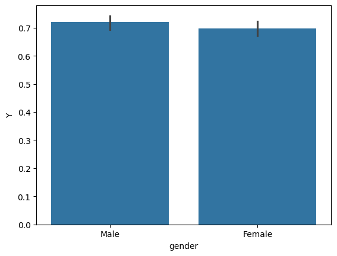
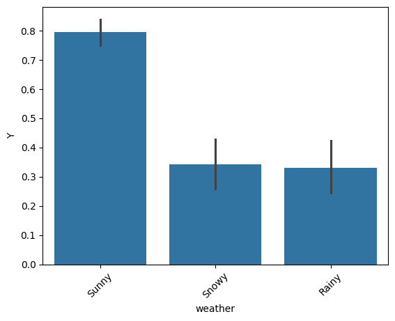

# AI-ML-Module5

# Based on the observations from the exercises given we can draw the following conclusions.
1. Drivers who went to bar 4 times or more per month had a high chance (77%) of accepting the bar coupon regardless of other factors
2. Bar goers (at least once a month) over the age of 25 are more likely to accept the bar coupons (68%). But they are not more likely than the overall frequent bar goers group.
3. A significant number (70.94 %) of drivers who go to bars more than once a month and had passengers that were not a kid and had occupations other than farming, fishing, or Forestry accepted the coupon
4. Drivers dining at cheap restaurents and income less than 50K are expected to not accept the bar coupon about half of the time

### Independent Investigation - Investigate the Restaurent(<20) coupon acceptance rate
### Problem Statement - 
#### Compare different type of drivers
1. Male vs Female drivers
2. Are unemployed or student by occupation and they are going with a friend
3. If the weather is Sunny vs Rainy or Snowy

### Conclusions based on the data analysis
1. The gender doesn't play much role in acceptance rate of Restaurant(<20) coupon with females being ever so slightly lower in accepting the coupon

2. A high number (79.13%) of drivers who are unemployed or student accept the cheap restaurant coupon while they were going with a friend
3. There is a high chance of coupon acceptance (80%) when the weather is Sunny vs when it is Rainy or Snowy'

### Next steps and recommendations
One recommendation would be analyze the entire data to present the highest changces of acceptance rate for different type of coupons and then the marketing can be turned for those conditions. E.g. the chances of 'Bar' coupon to be accepted when a person is going to work is not high.

